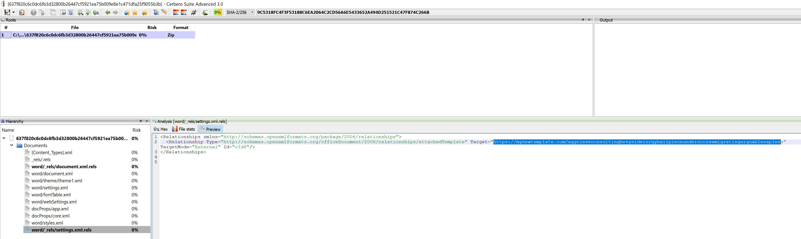

sha256 : **637f820c6c0dc6fb3d32800b26447cf5921ea75b009e8e1c471dfa25f9055b3b**

ITW Filename : **Вложение без имени 00054.doc**

It's (ab)using the Office feature [attachedTemplate](https://docs.microsoft.com/en-us/previous-versions/office/developer/office-2010/cc845524(v=office.14)) and downloading **hxxps://mynewtemplate[.]com/aggrieveconsultingbevysiderurgyhairpieceunderscoreemigratingarguablesapless**

The sha256 of **hxxps://mynewtemplate[.]com/aggrieveconsultingbevysiderurgyhairpieceunderscoreemigratingarguablesapless** is **3b754026ac9f03a0e5898c56f9966b8acb3405220ed2c8a79a3d7f6594cefebb**

Sadly the downloaded file is not malicious at all. So i got to try from another approach to confirm this sample.
