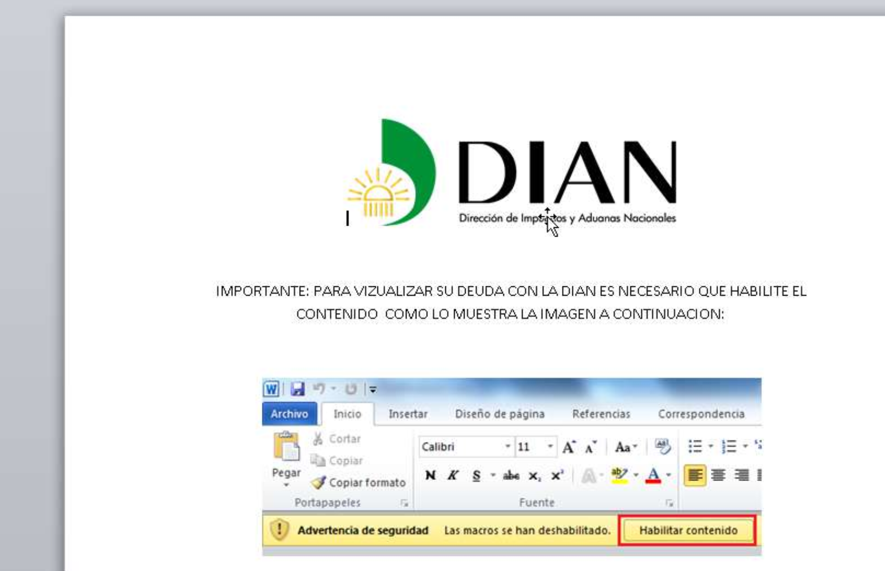
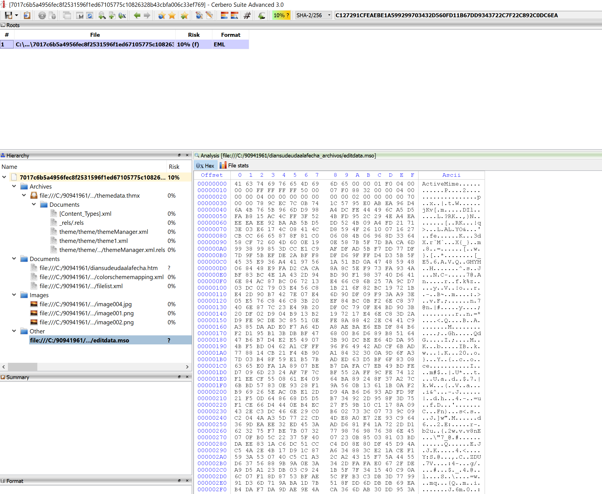

This is likely **#APT-C-36**

sha256 : **7017c6b5a4956fec8f2531596f1ed67105775c10826328b43cbfa006c33ef769**

ITW Filename : **dian su deuda a la fecha.doc**

We can see that there is .mso file with ActiveMIME. Probably containing the VBA that it's downloading and executing the payload.

We can see that it's downloading payload from **hxxp://medicosempresa[.]com/image/l.jpg**

sha256 of **hxxp://medicosempresa[.]com/image/l.jpg** is **8645356d9f3fcbdbda84294d29dbf377eea4893ba884c0d134cd75505a204405**
