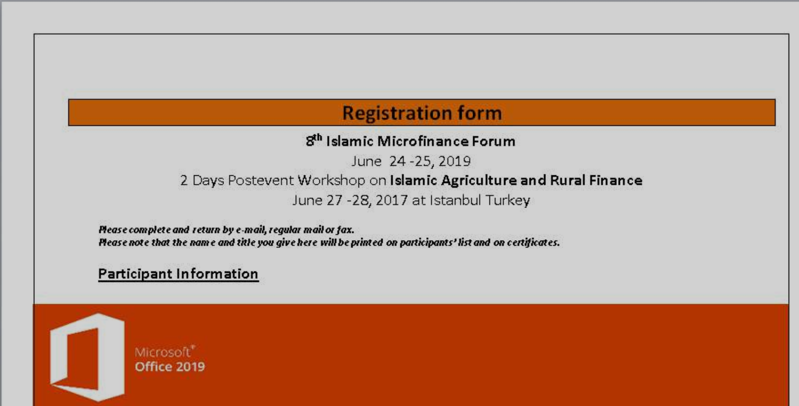

sha256 : **d9bcf4c4d0e546333c43d367ffa9e442008e4c25c02e1a649fe731e3f722c19c**

ITW Filename : **IMF Registration Form.doc**

The document seems to be targeting attendees to **Islamic Microfinance Forum**

We can see from the VBA that it's dropping and executing the VBE from **C:\Users\<username>\AppData\Roaming\MicroSoft\winDowS\StArt mEnU\pRogRaMS\StaRtuP\pKio.vbE**

It also dropped **C:\<username>\Public\p0pc0rn.tx**

The sha256 of **pKio.vbE** is **d26333ce8c760e3122c1537ace5b4c9d28bfb71989601e5267a5a499356bbd53**

C2 is **hxxp://185[.]82[.]202[.]240/ttryeJte76.php**

