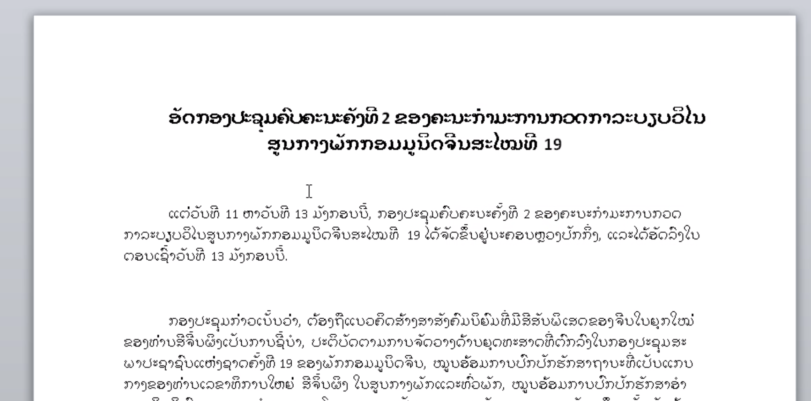
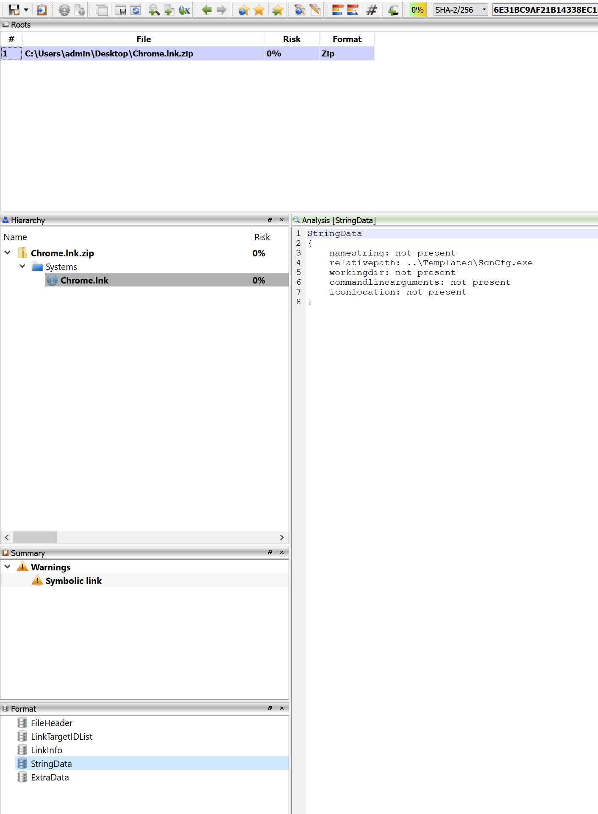

sha256 : **9d0c4ec62abe79e754eaa2fd7696f98441bc783781d8656065cddfae3dbf503e**

ITW Filename : **19.doc**

It's using **CVE-201-11882** and dropping the follwing files.

|File Location|sha256|
|---|---|
|C:\Users\<username>\AppData\Roaming\Microsoft\Windows\Templates\ScnCfg.exe|77361b1ca09d6857d68cea052a0bb857e03d776d3e1943897315a80a19f20fc2|
|C:\Users\<username>\AppData\Roaming\Microsoft\Windows\Templates\vsodscpl.dll|4a5bf0df9ee222dac87e2f1b38b18660ebb92de8ba3f1cbc845f945a766dd6a6|
|C:\Users\<username>\AppData\Roaming\Microsoft\Windows\Start Menu\Chrome.lnk|6e31bc9af21b14338ec15931dbba5a93e31b2d9e21fc7e59a9c91dc9953c42b5|

If were to analyse **Chrome.lnk**, we can see that it's using the **.lnk** file to execute **..\Templates\ScnCfg.exe**

**ScnCfg.exe** will in turn side-load the malicious **vsodscpl.dll**

C2 is **weather[.]gbaycruise[.]com**
