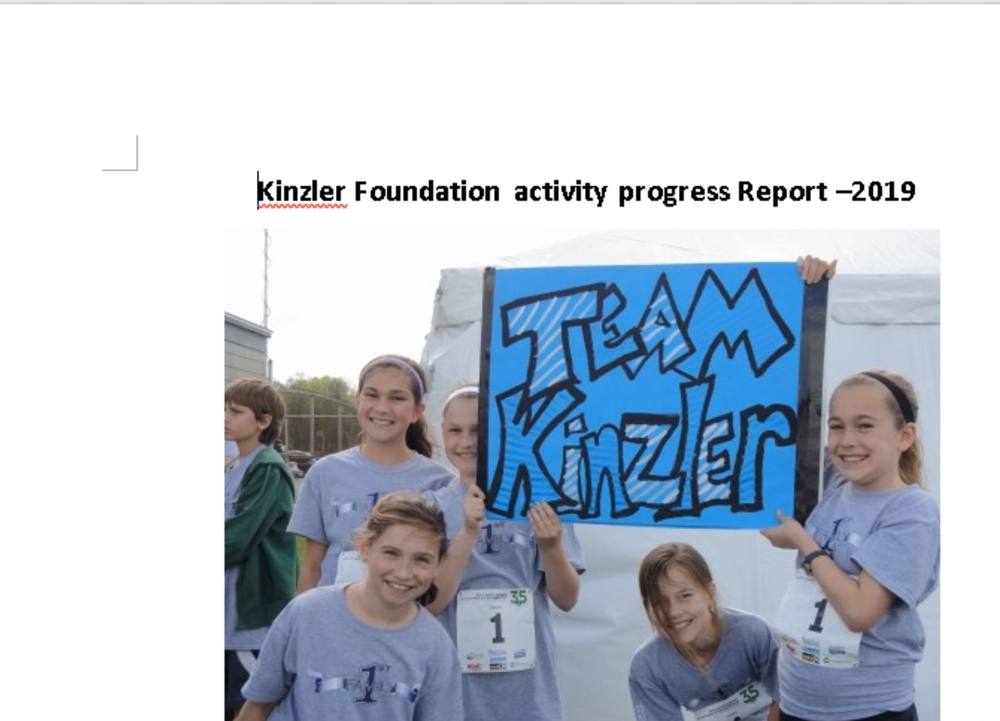

sha256 : **107204043717ef14e2439eb938cd9b1e94b62827f772dbb2005773a9ee746b02**

ITW Filename : **Kinzler Foundation for 2020 Tokyo Paralympic games.doc**

The VB will dropped the 1st payload to **C:\Users\<username>\AppData\Local\Microsoft\df.txt**

The sha256 of **df.txt** is **9512f70b55d6feab565d29256f7036e0c7170a78eff7217e8695d859a1a87c63**

**df.txt** is renamed to **gb.exe** and attempt to download

http://win10-ms[.]c1[.]biz/2.dat

http://win10-ms[.]c1[.]biz/3.dat

http://win10-ms[.]c1[.]biz/4.dat

The C2 is FTP Server：**ftpupload[.]net**

FTP username : **b6_24830682**

FTP password : **123qweASD!@#**

This C2 is used previously https://s.tencent.com/research/report/727.html
