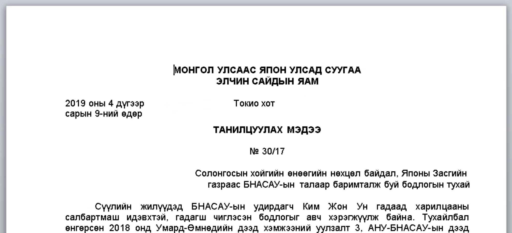

sha256 : **16cb245d9a78c81c25605695a2cf8dbdb36d85bcb61726c56ee358254253df2e**

ITW Filename : **ТM 30.17.doc**

This malicious document seems to be using **CVE-2017-11882**

It will drop the payload to **C:\Users\<username>\AppData\Roaming\Microsoft\Word\STARTUP\inteldrives.wll**
The sha256 of **cls.wll** is **d0ccb9a277b986f7127199f122023c79a7e0253378a4a78806fbf55a87633532**

It is using DLL Side loading to load the malicious DLL.

|Filename|sha256|
|---|---|
|RasTls.dll|d0ccb9a277b986f7127199f122023c79a7e0253378a4a78806fbf55a87633532|
|IntelGraphicsController.exe|724909ba378a872018a3ae0b68afe4949bc404de31bcbd65a6239c12b3a7a3ea|

C2 is **217.69.8.255**
