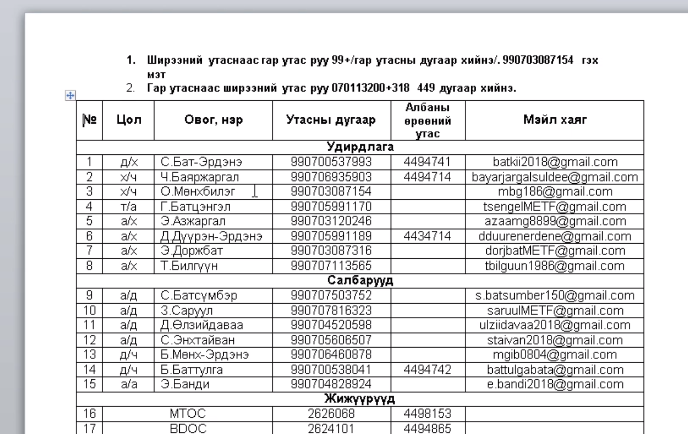

sha256 : **1e78ebbfb5fd1ee66f44030d52f80806d184e6daa00dd7aaa1a30b53c629912d**

ITW Filename : **Цэргийн багийн 8 ээлж ашиглагдах утасны дугаарын жагсаалт.doc**

This malicious document is using **CVE-201**

It will drop the payload to **C:\Users\<username>\AppData\Roaming\Microsoft\Word\STARTUP\cls.wll**
The sha256 of **cls.wll** is **d0ccb9a277b986f7127199f122023c79a7e0253378a4a78806fbf55a87633532**

It is using DLL Side loading to load the malicious DLL.

|Filename|sha256|
|---|---|
|RasTls.dll|d0ccb9a277b986f7127199f122023c79a7e0253378a4a78806fbf55a87633532|
|IntelGraphicsController.exe|724909ba378a872018a3ae0b68afe4949bc404de31bcbd65a6239c12b3a7a3ea|
