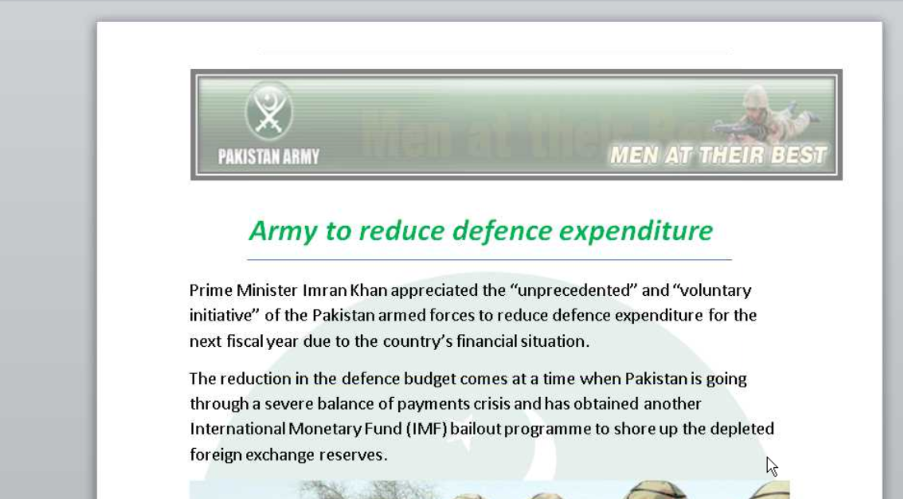
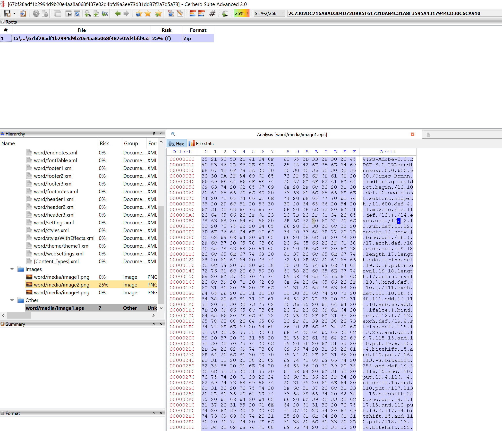
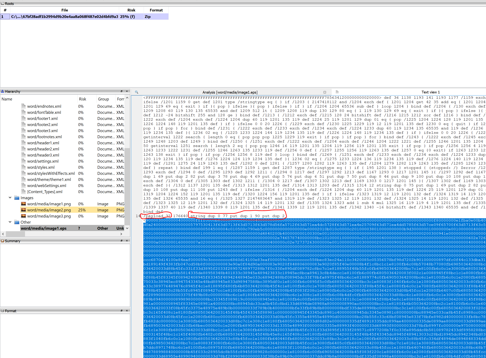

This looks a bit like **Patchwork** to me.

sha256 : **67bf28adf1b2994d9b20e4aa8a068f487e02d4bfd9a3ee73d81dd37f2a7d5a73**

ITW Filename : **Impact of reducing defence expenditure.docx**

This is another of those docx with malicious EPS. Looks to be using **CVE-2017-0261**

We can see the malicious EPS.

We can see how we can form back the payload manually by converting the first 2 bytes from decimal to hex and concat with the rest of the hex string.

The usage of **BaiduUpdateTask1** reminds me of **#Patchwork**

There are a total of 5 payloads which you can extract manually.
