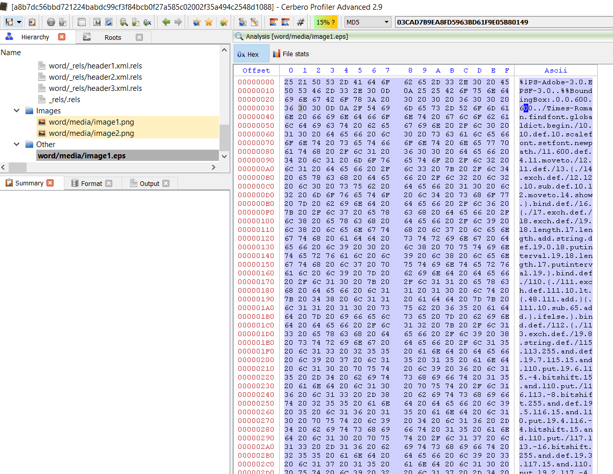
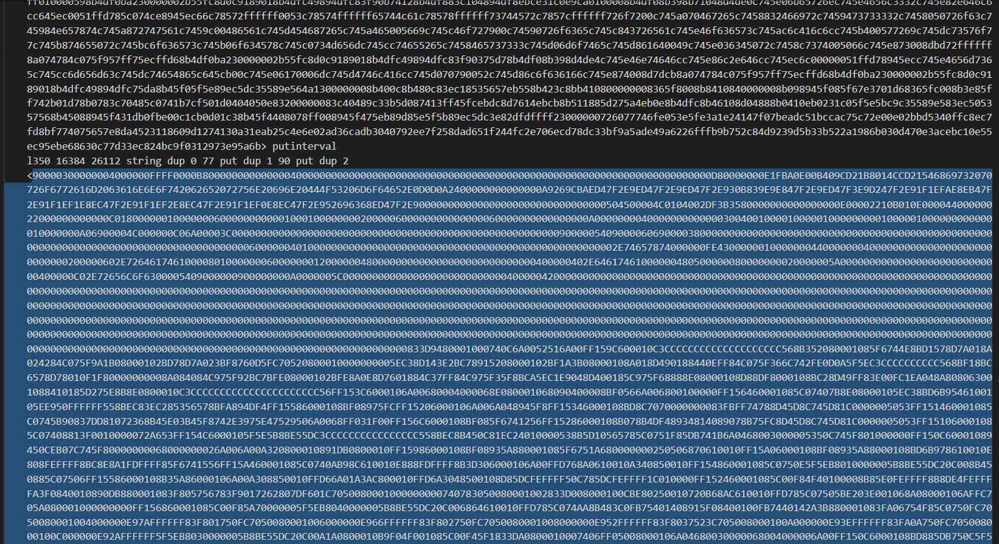

This looks a bit like **Patchwork** to me.

sha256 : **a8b7dc56bbd721224babdc99cf3f84bcb0f27a585c02002f35a494c2548d1088**

ITW Filename : **Eid_Holidays.docx**

This is another of those docx with malicious EPS. Looks to be using **CVE-2017-0261**

We can see the malicious EPS.

We can see how we can form back the payload manually by converting the first 2 bytes from decimal to hex and concat with the rest of the hex string.

The usage of **BaiduUpdateTask1** reminds me of **#Patchwork**

There are a total of 5 payloads which you can extract manually.

But the final location is at **C:\Users\<username>\AppData\Roaming\Microsoft\Internet Explorer\MSDefend.exe**
