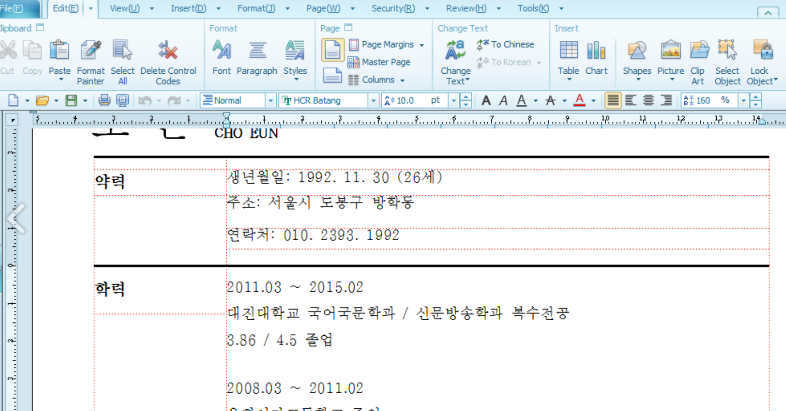

sha256 : **03ccaeb9757ce1f54b1cbe9d1d15e5da53a9764343bb015ee8ca623d96d6e680**

ITW Filename : **조은_제17기 북한선교학교 신청서.hwp**

This is another of those HWP with malicious EPS. Looks to be using **CVE-2017-8291**

The payload is XOR encoded.
