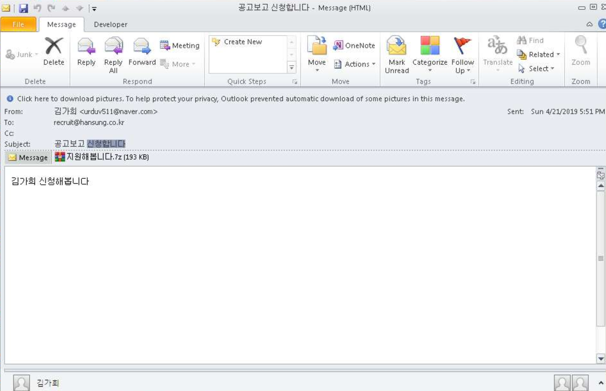

sha256 : **5d0e8e07a3e46d18d585d482d6235dc0a483b8ef893957737712ea27f693566f**

ITW Filename : **공고보고 신청합니다 (2019-04-22 01-51).eml**

If we were to analyse the meta data of the .eml file, we can see that it's sent on the **2019-04-22**

We can also see the original email is sent from as **김가희 <urduv511@naver.com>** and sent to **recruit@hansung.co.kr**

The subject of the email is **공고보고 신청합니다**

Inside the **지원해봅니다.7z**, there is a binary file, **이름.pdf .exe **

The sha256 of **지원해봅니다.7z** is **2bc129cb942b68b008a15136aeb1c226ea87f336dbef2bd4a9035f80fa142e4b**

The sha256 of **이름.pdf .exe ** is **248b8c7a4e9ac813df4870b52d132c02b80ed856216e472e40b7eca0a5e30908**

C2 is **hxxp://www[.]kakaocorp[.]link**

This is **GandGrab**
