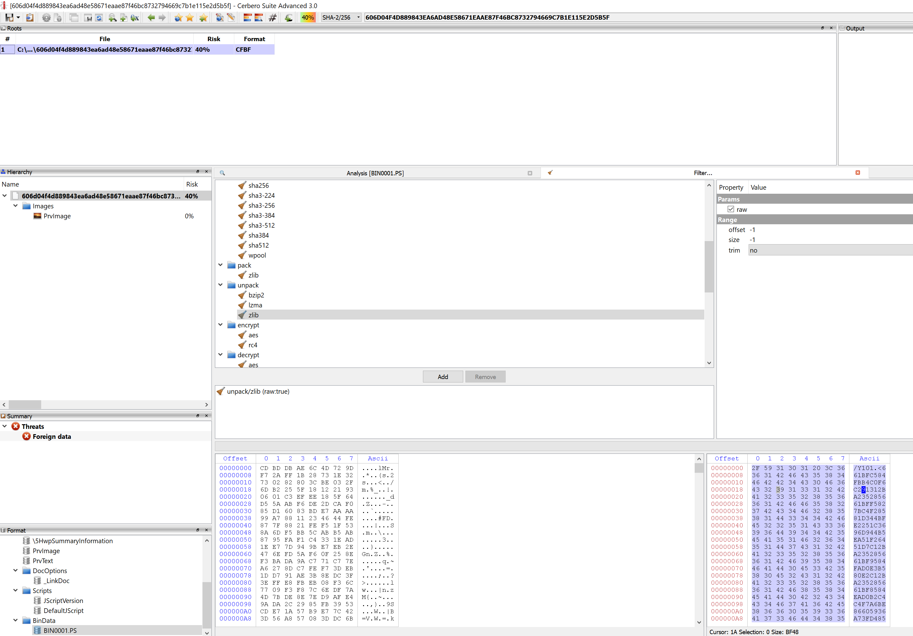

sha256 : **606d04f4d889843ea6ad48e58671eaae87f46bc8732794669c7b1e115e2d5b5f**

ITW Filename : **시스템 포팅 계약서(수정).hwp**

This is another of those HWP with malicious EPS.

From the shellcode, we can find the following C2:
|No.|URL|
|---|---|
|1|**technokain[.]com**|
|2|**www[.]payngrab.com**|
|3|**www[.]weeklyexperts[.]com **|
