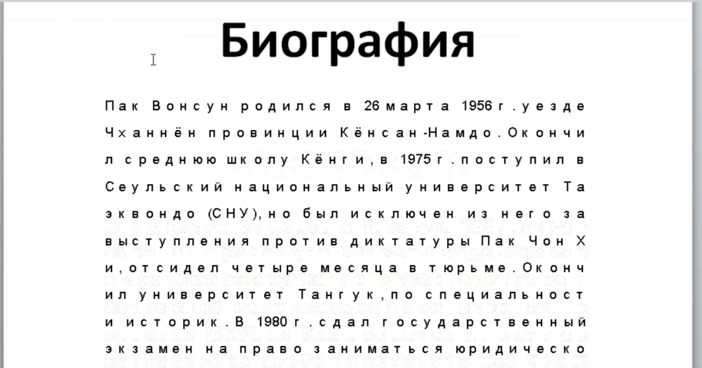

sha256 : **7079d8c92cc668f903f3a60ec04dbb2508f23840ef3c57efffb9f906d3bc05ff**

ITW Filename : **Мэр Сеула.rtf** (Google translate it to **Mayor of Seoul.rtf**)

It will drop the payload to **C:\Users\<username>\AppData\Local\Temp\secinit.exe**

The sha256 of **secinit.exe** is **5e8df46c9bc75450e2660d77897fa3dfa4d6c21eea10a962f7a9cf950ca9ca76**

It will drop INFOP11.exe and oinfo11.ocx.

INFOP11.exe will load oinfo11.ocx

Connects to **hxxp://loge[.]otzo[.]com**

Looks a bit like *PlugX* on brief look.

# References : 
Being alerted by a friend. --> https://twitter.com/securitydoggo/status/1139537091384303617
