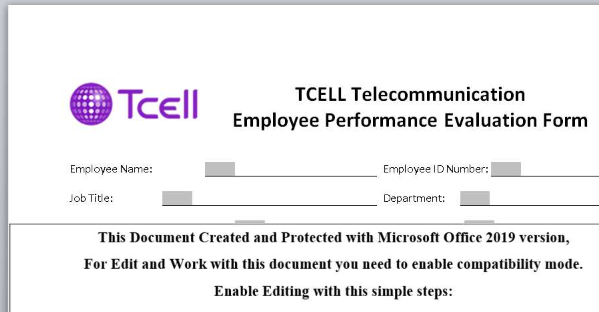

sha256 : **82918f0396e738fb0833d65ef582607ce3c19f973740c8a5d179b2b4e764605b**

ITW Filename : **Performance_Eval_Employee.doc**

The document seems to be using **TCELL Communications** as lure.

It's dropping **C:\Users\<username>\AppData\RoAMing\MiCROSoFT\wINDoWs\StArt MENu\pROgrAMs\StArtup\S0NN3.VbE** and executing the **.vbe file**

It will attempt to download the payload from **hxxp://185[.]141[.]27[.]14/Newsii/qhqbT4Wcha**
