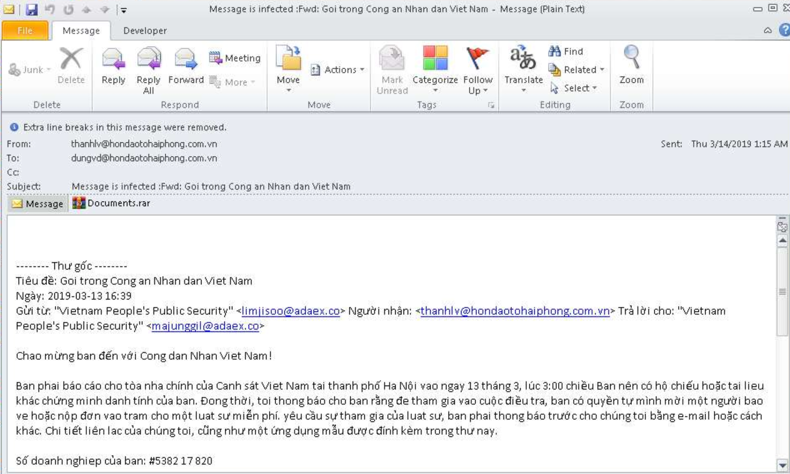

sha256 : *e18de99dda5217d819ad7aa9295c1cebb6ae558f54516acfa76ebbe263979ca8*

ITW Filename : *Message is infected :Fwd: Goi trong Cong an Nhan dan Viet Nam.msg*

If we were to analyse the meta data of the .msg file, we can see that it's sent on the *2019-03-13*

We can also see the original email is spoofed as *"Vietnam People's Public Security" <limjisoo@adaex.co>* and sent to *thanhlv@hondaotohaiphong.com.vn*

The *Reply-To* is to *"Vietnam People's Public Security" <majunggil@adaex.co>*

Inside the *Documents.rar*, there is a binary file, *Tài liệu về vụ án 5382 17 820.doc.exe*

The sha256 of *Documents.rar* is *7765682ac595f5ad60399c9032808ed015133adc02ca1e54bb8a5e9343adbd43*

The sha256 of *Tài liệu về vụ án 5382 17 820.doc.exe* is *9bcaa43b34e766140a8d0bfc426ae01c2f3e5c9bf780073ea9f2edba304ac882*

C2 is hxxp://www[.]kakaocorp[.]link 

This is *GandGrab*
